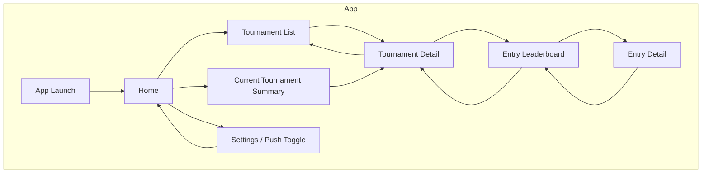
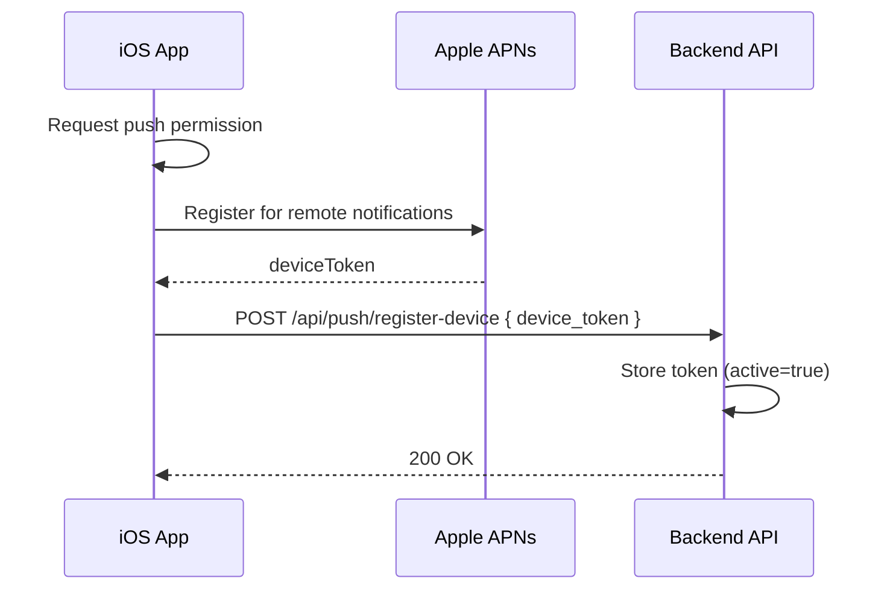
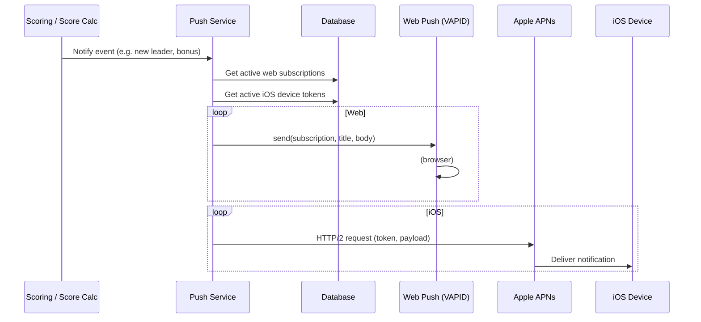
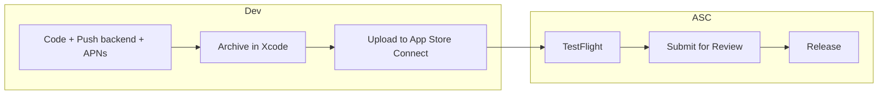

# iOS Read-Only App & App Store Implementation Guide

This document is the single source of truth for shipping the **read-only Masters pool iOS app** (no admin functions) with **push notifications** to the App Store. It is written for future implementers.

---

## 1. Overview

| Item | Description |
|------|-------------|
| **Product** | iOS app for the Eldorado Masters Golf Pool: view leaderboards, entries, and tournament info. No admin features. |
| **Push** | Notifications for: new leader, eagle / hole-in-one / double eagle, round complete (optional), and optionally big position moves. |
| **Stack** | Backend: FastAPI (Railway). Web: React/Vite (Vercel). DB: Supabase/PostgreSQL. iOS: SwiftUI, native. |
| **Scope** | Read-only consumption of existing public API; push requires backend and Apple (APNs) additions. |

---

## 2. Product Scope

### 2.1 In Scope (Read-Only App)

- **Home** – Tournament list or current tournament summary; quick link to leaderboard.
- **Tournament leaderboard** – Overall standings (entries + total points). Data from existing API.
- **Entry leaderboard** – Same data, possibly with filters/sort (e.g. by round).
- **Entry detail** – Single entry: participant name, 6 players (and rebuys if applicable), daily scores, bonus points, totals. Data from `GET /api/entry/{id}`.
- **Tournament detail** – Tournament info, rounds, link to leaderboard.
- **Push notifications** – Opt-in; events below.
- **Optional:** Activity / “What’s new” (e.g. recent bonuses, leader changes) if time permits.

### 2.2 Out of Scope (No Admin)

- No login/admin auth in the app.
- No creating/editing entries, players, tournaments, or bonus points.
- No import/sync/jobs/diagnostics UI.
- Admin remains web-only.

### 2.3 Push Notification Events

Send push when:

| Event | When | Example payload |
|-------|------|------------------|
| **New leader** | Leaderboard #1 changes (same round) | "X is the new leader with Y points (Round N)" |
| **Eagle / HIO / Double eagle** | Bonus awarded for that type | "Player Z got an eagle on hole 5" (or HIO / double eagle) |
| **Round complete** (optional) | Round marked complete | "Round N complete" |
| **Big move** (optional) | Entry moves 5+ positions in one round | "Entry X moved from 12th to 5th" |

Backend already sends **Discord** and **web push** for some of these; iOS push must be triggered from the **same** code paths (see Backend section).

---

## 3. System Architecture

```
┌─────────────────────────────────────────────────────────────────────────────┐
│                              EXTERNAL SERVICES                                │
├─────────────────┬─────────────────┬─────────────────┬───────────────────────┤
│  Slash Golf API │  APNs (Apple)    │  Discord        │  Supabase (Postgres)  │
└────────┬────────┴────────┬────────┴────────┬────────┴──────────────┬────────┘
         │                 │                 │                       │
         ▼                 ▼                 ▼                       ▼
┌─────────────────────────────────────────────────────────────────────────────┐
│                         BACKEND (FastAPI – Railway)                          │
│  • Public API: /api/tournament, /api/scores, /api/entry, /api/push           │
│  • Scoring + sync jobs → Discord + Web Push + (new) iOS Push                 │
│  • Push: Web (VAPID) + iOS (APNs); store: push_subscriptions + device_tokens│
└─────────────────────────────────────────────────────────────────────────────┘
         │
         │ HTTPS (public API only)
         ▼
┌─────────────────────────────────────────────────────────────────────────────┐
│                         iOS APP (SwiftUI, native)                            │
│  • Read-only UI → GET /api/* only                                             │
│  • Push: request permission → APNs token → POST /api/push/register-device    │
└─────────────────────────────────────────────────────────────────────────────┘
```

---

## 4. App Screen & Navigation Flow



- **Home**: Entry point; links to tournament list and current tournament.
- **Tournament list**: From `GET /api/tournament/list` (or equivalent).
- **Tournament detail**: One tournament; from `GET /api/tournament/{id}` or similar; link to leaderboard.
- **Entry leaderboard**: From scores/leaderboard API for that tournament/round.
- **Entry detail**: From `GET /api/entry/{entry_id}`.
- **Settings**: At least push on/off; optionally about/legal links.

---

## 5. Backend: Current State & Required Changes

### 5.1 Current State

- **Public API** (no auth): `tournament`, `scores`, `entries`, `health`, `ranking_history`, `validation`, `push` (see `backend/app/main.py`).
- **Push (Web only)**:
  - **Model**: `PushSubscription` (`backend/app/models/push_subscription.py`): `endpoint` (unique), `subscription_data` (JSON for VAPID/keys), `active`.
  - **Endpoints**: `POST /api/push/subscribe`, `POST /api/push/unsubscribe`, `GET /api/push/public-key`, `GET /api/push/status` (in `backend/app/api/public/push.py`).
  - **Sending**: `PushNotificationService` in `backend/app/services/push_notifications.py` uses **pywebpush** and VAPID; sends to `subscription_data` (web only).
  - **Hooks**:
    - **Bonus (eagle/HIO/double eagle)**: `ScoringService._notify_push_bonus_async` in `backend/app/services/scoring.py` (queries `PushSubscription`, sends via push_service).
    - **New leader / big move**: `ScoreCalculatorService` in `backend/app/services/score_calculator.py` calls `_notify_push_new_leader_async` and `_notify_push_big_move_async` — **these methods are not yet implemented** (calls exist, implementations do not). Discord is sent for the same events.

### 5.2 Required Backend Changes

1. **Store iOS device tokens**
   - Either:
     - **Option A**: New table `ios_push_tokens` with columns e.g. `id`, `device_token` (unique), `active`, `created_at`, `updated_at`; or
     - **Option B**: Extend `PushSubscription` with `platform` (`web` | `ios`) and use `endpoint` to store the APNs device token for iOS (and keep `subscription_data` for web only).
   - Recommendation: **Option A** keeps web and iOS clearly separated and avoids overloading `endpoint`/`subscription_data`.

2. **Public API for iOS**
   - `POST /api/push/register-device`: body `{ "device_token": "<apns_token>" }`. Create or update record; set `active = true`.
   - `POST /api/push/unregister-device`: body `{ "device_token": "<apns_token>" }`. Set `active = false` (or delete).
   - No auth for these (same as web subscribe/unsubscribe); token itself is the identifier.

3. **APNs sending**
   - Add an **APNs sender** (e.g. `backend/app/services/apns.py` or inside `push_notifications.py`):
     - Use Apple’s HTTP/2 APNs API with **.p8 Auth Key** (Key ID, Team ID, Bundle ID).
     - Dependencies: e.g. `aiohttp` + `python-jose`/`jwcrypto` for JWT, or a small library that wraps APNs HTTP/2.
   - Config (env): `APNS_KEY_ID`, `APNS_TEAM_ID`, `APNS_BUNDLE_ID`, `APNS_AUTH_KEY_BASE64` or path to .p8, `APNS_USE_SANDBOX` (true for dev).

4. **Unified “send push” flow**
   - For each event (new leader, bonus, round complete, big move):
     - Keep existing: Discord + web push (current code).
     - Add: query active iOS tokens and send the same (or similar) message via APNs.
   - Implement missing `_notify_push_new_leader_async` and `_notify_push_big_move_async` in `ScoreCalculatorService` to send **web push** (and from there call a shared helper that also sends **iOS push**), so one place defines “what to send” and “who gets it” (web + iOS).

### 5.3 Where to Hook iOS Push (Same Events as Discord / Web)

| Event | Location | What to add |
|-------|----------|-------------|
| Eagle / HIO / Double eagle | `ScoringService._notify_push_bonus_async` (scoring.py) | After sending web push, get active iOS tokens and send via APNs. |
| New leader | `ScoreCalculatorService._notify_discord_position_changes` → `_notify_push_new_leader_async` (score_calculator.py) | Implement `_notify_push_new_leader_async`: send web push + iOS push. |
| Big move | Same block → `_notify_push_big_move_async` | Implement `_notify_push_big_move_async`: send web push + iOS push. |
| Round complete (optional) | Where round completion is set (e.g. sync or job) | Call a shared “send round complete” helper → Discord + web + iOS. |

---

## 6. Push Notification Flows

### 6.1 Device Registration (iOS → Backend)



- App calls `UNUserNotificationCenter.requestAuthorization`, then `UIApplication.shared.registerForRemoteNotifications()`.
- In `application(_:didRegisterForRemoteNotificationsWithDeviceToken:)`, convert token to string and `POST /api/push/register-device`.
- On logout or “disable push”, call `POST /api/push/unregister-device` and optionally stop registering for remote notifications.

### 6.2 Sending a Notification (Backend → APNs → Device)



- One logical “event” (e.g. “new leader”) is sent to both web and iOS from the same backend code path.

---

## 7. iOS App Architecture (Concise)

- **UI**: SwiftUI only; no admin screens.
- **Networking**: Use `URLSession` or a small client to call existing public API base URL (e.g. `https://<backend>/api`).
- **Screens**: Home, Tournament List, Tournament Detail, Entry Leaderboard, Entry Detail, Settings (push toggle, about).
- **Data**: Decode API responses into local models (e.g. `Tournament`, `Entry`, `LeaderboardEntry`); no persistence required for MVP beyond optional cache.
- **Push**:
  - On first launch (or from Settings): request notification permission.
  - After permission, register for remote notifications; in `AppDelegate` (or SwiftUI lifecycle) send token to `POST /api/push/register-device`.
  - Handle notification tap: open to relevant screen (e.g. leaderboard or entry) using payload or default to Home.

---

## 8. App Store Process (Step-by-Step)

### 8.1 Prerequisites

- **Apple Developer Program** membership ($99/year).
- **Mac** with Xcode; app built for **iOS** (e.g. 15+), no admin.

### 8.2 Apple Developer Setup

1. **App ID**
   - Certificates, Identifiers & Profiles → Identifiers → + → App IDs.
   - Type: App. Explicit Bundle ID (e.g. `com.yourorg.masterspool`).
   - Enable capability: **Push Notifications**.

2. **APNs Auth Key (.p8)**
   - Keys → + → Name it (e.g. “Masters Pool APNs”), enable **Apple Push Notifications (APNs)**.
   - Download the .p8 once; store securely. Note **Key ID**.
   - In Membership: note **Team ID**. In App ID: **Bundle ID**.

3. **Provisioning**
   - Use **Automatically manage signing** in Xcode with your Apple ID, or create a Distribution profile for “App Store” with the same App ID and Push capability.

### 8.3 App Store Connect

1. **App**
   - My Apps → + → New App. Platform: iOS. Name, language, Bundle ID (same as above), SKU.

2. **Metadata**
   - Description, keywords, support URL, marketing URL (optional).
   - Privacy Policy URL (required).
   - Category (e.g. Sports or Entertainment).
   - Age rating questionnaire.

3. **Push**
   - No extra App Store Connect step for push; backend uses APNs with the same Bundle ID and .p8 key. Use **Sandbox** for TestFlight, **Production** for release.

### 8.4 Build & Upload

1. In Xcode: scheme → **Any iOS Device (arm64)**; Product → Archive.
2. Organizer → Distribute App → **App Store Connect** → Upload.
3. After processing, build appears in App Store Connect under TestFlight and later under the app version.

### 8.5 TestFlight

- In App Store Connect: add internal/external testers; install via TestFlight app. Use **Sandbox** APNs for TestFlight builds.

### 8.6 Submit for Review

- Create version (e.g. 1.0); attach build; fill “What to test”; submit. Resolve any rejection (metadata, permissions, crashes).

### 8.7 Release

- After approval: release manually or automatically. App then appears on the App Store.

---

## 9. App Store Pipeline (High-Level)



---

## 10. Implementation Checklist (Phases)

- [ ] **Backend**
  - [ ] Add `ios_push_tokens` (or extend push model) + migration.
  - [ ] Add `POST /api/push/register-device` and `POST /api/push/unregister-device`.
  - [ ] Implement APNs sender (HTTP/2 + .p8); add env vars.
  - [ ] Implement `_notify_push_new_leader_async` and `_notify_push_big_move_async` (web + iOS).
  - [ ] In `_notify_push_bonus_async`, add iOS send.
  - [ ] (Optional) Round-complete and any other event → web + iOS.
- [ ] **iOS**
  - [ ] SwiftUI project; Bundle ID matches App ID.
  - [ ] Screens: Home, Tournament List/Detail, Entry Leaderboard, Entry Detail, Settings.
  - [ ] API client for public endpoints only.
  - [ ] Push: permission, token, register/unregister with backend; handle tap (deep link to screen).
- [ ] **Apple / App Store**
  - [ ] App ID with Push; .p8 key; Team ID, Key ID, Bundle ID in backend env.
  - [ ] App Store Connect app; metadata; privacy URL; screenshots; TestFlight.
  - [ ] Archive → Upload → Submit → Release.

---

## 11. Diagram Reference

| Diagram | Section | Purpose |
|--------|---------|---------|
| System architecture | §3 | Backend, iOS, APNs, Discord, DB |
| App screen flow | §4 | Navigation between screens |
| Device registration | §6.1 | iOS → APNs → Backend token storage |
| Send notification | §6.2 | Event → Backend → Web + APNs → devices |
| App Store pipeline | §9 | Develop → TestFlight → Review → Release |

---

## 12. Security & Privacy Notes

- **API**: Public API remains unauthenticated; no secrets in the iOS app beyond API base URL.
- **Push tokens**: Treat as sensitive; store in DB with `active` flag; unregister when user disables push.
- **APNs .p8**: Server-side only; never in the app or repo.
- **Privacy**: In App Store Connect and in-app, describe that push is used for leaderboard and tournament updates (and optionally link to privacy policy).

---

*Document version: 1.0. For the read-only iOS app with push notifications and App Store release.*
